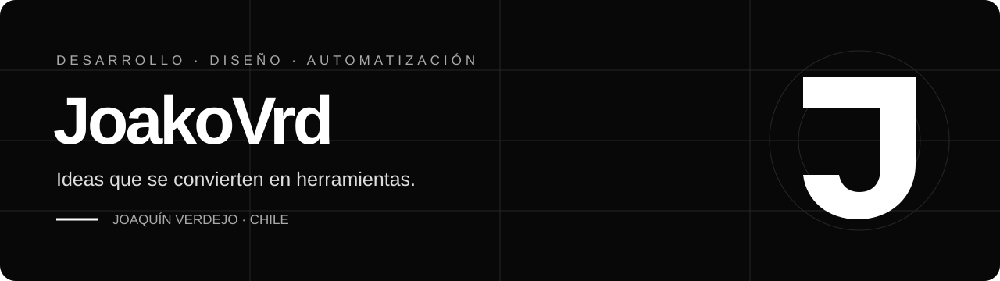

# Joaquín Verdejo · JoakoVrd

Desarrollo interfaces web y herramientas de automatización. Combino programación y diseño para convertir una necesidad concreta en una solución que se pueda usar, revisar y mejorar.

**Disponible para colaborar por proyecto.** [Conversemos por correo](mailto:joakovrd@gmail.com).

## Proyectos seleccionados

Estos son proyectos propios. Cada repositorio permite revisar su código, alcance y forma de uso.

| Proyecto | Qué encontrarás | Enlaces |
| :--- | :--- | :--- |
| **DORN AGRO** | Sitio web y experiencia interactiva sobre riego inteligente, con simulación de dispositivos. | [Ver demo](https://joakovrd-designer.github.io/dorn-agro/) · [Código](https://github.com/JoakoVRD-Designer/dorn-agro) |
| **Conexión Servicio** | Aplicación con catálogo de servicios, pedidos, portal de cliente y gestión de entregas. Desarrollada con Node.js y Express; incluye pruebas del flujo. | [Repositorio](https://github.com/JoakoVRD-Designer/Conexion-Servicio) |
| **Personal Profile** | Perfil web editable con efectos visuales y herramientas de publicación. | [Repositorio](https://github.com/JoakoVRD-Designer/Personal-Profile) |
| **Tribridge** | Herramienta de línea de comandos para delegar tareas y revisar cambios entre agentes de programación. Compatible con Windows y con pruebas automatizadas. | [Repositorio](https://github.com/JoakoVRD-Designer/tribridge) |

## En qué puedo ayudarte

- **Interfaces y páginas web:** páginas de presentación, formularios, adaptación visual y mejoras en sitios existentes.
- **Automatización:** scripts para tareas repetitivas, procesamiento de datos e integración de flujos sencillos.
- **Herramientas internas:** paneles y prototipos con alcance definido para validar una idea.
- **Diseño digital:** piezas gráficas y recursos visuales para creadores y pequeños negocios.

## Cómo trabajo

1. Entendemos el problema y revisamos los materiales disponibles.
2. Acordamos entregables, presupuesto, plazo y revisiones.
3. Preparo una primera versión para comprobar que el enfoque funciona.
4. Verificamos el resultado y entrego lo acordado con instrucciones de uso.

Trabajo principalmente con **JavaScript, HTML, CSS, Node.js y Python**. Uso herramientas de IA como apoyo en el desarrollo y reviso el resultado antes de entregarlo.

## Contacto

**[joakovrd@gmail.com](mailto:joakovrd@gmail.com)**

Para cotizar, cuéntame qué necesitas, qué tienes preparado y para cuándo lo necesitas. Mi disponibilidad es principalmente por las tardes y fines de semana.

[Comunidad en Discord](https://discord.gg/sa296brC7w) · [Directos en Kick](https://kick.com/joako-vrd)
